# BMAD Pack

[BMAD Method](https://github.com/bmad-code-org/BMAD-METHOD) is a document-first
delivery process: write a PRD, design the architecture, decompose it into
epics and stories, gate on implementation readiness, implement story by story,
then run adversarial code review. This pack vendors the BMAD Method skills and
runs that process as a durable Gas City build factory: every stage is a bead in
a graph that Gas City can retry, observe, and resume, and the result is a
reviewed implementation in your repository with a full artifact trail.

## When to choose bmad

- You want disciplined, document-first delivery: an explicit PRD and
  architecture document exist before any code, and an implementation-readiness
  gate blocks coding until the stories are actually ready.
- You want per-story rigor: each story gets its own implement, self-check,
  acceptance-audit, and fix loop, followed by a four-lane adversarial code
  review (blind-hunter, edge-case, acceptance-audit, gap-analysis).
- Prefer `build-basic` (in the `gascity` pack) when you want the default
  starter factory with fewer stages and a single-lane review.
- Prefer `compound-engineering` when review breadth matters most (20+
  specialist reviewer lanes), or `superpowers` when you want hard spec-approval
  gates and strict per-task TDD.

## Quick start

Prerequisites: Gas City installed and a city running, plus a git repository
registered as a rig. If you have not done that yet:

```sh
brew install gascity
gc init ~/my-city
cd ~/my-city
gc start
```

```sh
mkdir proj && cd proj && git init
gc rig add .
```

1. **Import the pack.** From the city directory, add bmad at city scope. This
   writes the import, fetches the latest release, and pins it in `packs.lock`
   — no clone needed. The pack imports the Gas City base pack internally as
   `gc`, so `build-base` and the `gc.*` formula surface are available
   transitively:

   ```sh
   gc import add https://github.com/gastownhall/gascity-packs.git//bmad
   ```

2. **Import the rig roles in `city.toml`.** The rig additionally needs the
   `gascity/roles` import so the `gc.*` role agents (operator, publisher,
   and friends) can run work inside the target repository; run
   `gc import install` after editing:

   ```toml
   [[rigs]]
   name = "proj"

   [rigs.imports.gc]
   source = "https://github.com/gastownhall/gascity-packs.git//gascity/roles"
   ```

   Contributors working on the packs themselves can clone
   `https://github.com/gastownhall/gascity-packs` and point either `source`
   at the local path (for example `../gascity-packs/bmad`) instead.

3. **Launch your first build.** `bmad-build` is targeted
   (`target_required = true`), so create a bead describing the goal first,
   then sling the formula at it from the target rig context:

   ```sh
   gc bd create "Add a --json flag to the export command"
   gc sling gc.run-operator <bead-id> --on bmad-build \
     --var artifact_root=plans/json-flag/build \
     --var drain_policy=separate
   ```

   `artifact_root` is the only required variable; everything else has a
   default (see Customization below).

4. **What happens next.** The workflow walks these stages in order: prepare,
   PRD requirements, architecture plan, architecture handoff review,
   epics/stories decomposition, implementation readiness, the story
   implementation drain, adversarial code review, finalize, publish. Stage
   artifacts (PRD, architecture document, decomposition, readiness report,
   review reports, final summary) land under `artifact_root` in your rig.

5. **Watch progress.** The workflow root bead carries the run state and the
   `gc.build.*` handoff metadata; list beads with `gc bd --rig <rig>` and
   convoys with `gc convoy --rig <rig>`. The default `interaction_mode` is
   `interactive`, so the run halts for your input at BMAD checkpoints — each
   halt records a resume note, and `gc session attach <session>` drops you
   into the waiting session. Pass `--var interaction_mode=autonomous` if you
   would rather it run unattended.

## Stage map

`bmad-build` extends `build-base` and keeps the inherited anchor order
`prepare -> requirements -> plan -> plan-review -> decompose ->
implement/implement-same-session -> review -> finalize -> publish`. The pack
overrides `requirements` (PRD), `plan` (architecture), `plan-review`
(architecture handoff review), `decompose` (epics and stories),
`implement`/`implement-same-session` (story-development drains), and `review`
(adversarial code-review loop); `prepare`, `finalize`, and `publish` stay
inherited. `implementation-readiness` is the only pack-added step: it needs
`decompose`, both implementation drains need it, and its gate is the readiness
review run by `bmad.readiness-reviewer`, which records the readiness report
path and outcome on the workflow root bead before implementation begins. No
base anchor is renamed, skipped, or reordered.

The native stage formulas extend the matching base methodology contracts:
`bmad-planning` (`planning-base`), `bmad-decomposition`
(`decomposition-base`), `bmad-implementation` (`implement`), `bmad-review`
(`code-review-base`), and `bmad-fix-loop` (`fix-loop-base`). `bmad-build`
pins them as its selector defaults (`planning_formula`,
`decomposition_formula`, `implementation_formula`,
`implementation_item_formula` `bmad-story-development-item`,
`code_review_formula`, `review_fix_formula`) with `implementation_target`
defaulting to `bmad.story-implementer`.

Supported modes and drain policies, as declared in
`[metadata.gc.methodology]`:

| Axis | Values | Default | Meaning |
| ---- | ------ | ------- | ------- |
| `interaction_mode` | `interactive`, `autonomous`, `headless` | `interactive` | BMAD's menu/checkpoint axis: interactive runs preserve halts and user choices; headless automation expects all required inputs up front. |
| `review_mode` | `report`, `agent`, `interactive` | `agent` | `report` synthesizes findings without applying fixes; `agent` and `interactive` feed the fix loop until the approval check passes. |
| `drain_policy` | `separate`, `same-session` | `separate` | `separate` drains `bmad-story-development` item formulas in parallel worktrees with exclusive member access; `same-session` drains `bmad-story-development-item` in one shared single-lane session with `on_item_failure = "skip_remaining"`. |

```mermaid
flowchart TD
    classDef inherited fill:#eef2ff,stroke:#4f46e5,color:#111827;
    classDef bmad fill:#ecfdf5,stroke:#059669,color:#111827;
    classDef infra fill:#fff7ed,stroke:#d97706,color:#111827;
    classDef terminal fill:#f9fafb,stroke:#6b7280,color:#111827;

    Start["Launch bmad-build"]:::terminal --> Prepare["prepare<br/>inherited build-base"]:::inherited
    Prepare --> PRD["requirements<br/>BMAD PRD override"]:::bmad
    PRD --> Architecture["plan<br/>BMAD architecture override"]:::bmad
    Architecture --> ArchReview["plan-review<br/>BMAD architecture handoff override"]:::bmad
    ArchReview --> Decompose["decompose<br/>BMAD epics and stories override"]:::bmad
    Decompose --> Readiness["implementation-readiness<br/>BMAD readiness gate override"]:::bmad
    Readiness --> DrainChoice{"drain policy<br/>Gas City drain"}:::infra
    DrainChoice -->|separate| DrainSeparate["separate drain<br/>parallel by convoy deps"]:::infra
    DrainChoice -->|same-session| DrainShared["same-session drain<br/>single worker lane"]:::infra

    subgraph StoryFormula["bmad-story-development item formula: one formula instance per story bead"]
        direction TB
        SeparatePrep["prepare-worktree<br/>inherited do-work<br/>separate drain only"]:::inherited --> StoryLoopStart["run BMAD story development<br/>override control step"]:::bmad
        SharedStoryStart["run BMAD shared story development<br/>override implement-item"]:::bmad
        StoryLoopStart --> StorySetup["setup-bmad-story-development"]:::bmad
        SharedStoryStart --> StorySetup
        StorySetup --> ImplementStory["implement-story"]:::bmad
        ImplementStory --> SelfCheck["story-self-check"]:::bmad
        SelfCheck --> AcceptanceAudit["acceptance-audit"]:::bmad
        AcceptanceAudit --> ApplyStory["apply-story-findings"]:::bmad
        ApplyStory --> StoryGate{"story clean?<br/>implementation-review check"}:::infra
        StoryGate -->|no: fix story and re-check| StorySetup
        StoryGate -->|yes| StoryDone["story accepted"]:::bmad
        StoryDone --> CloseStory["close source anchor<br/>inherited do-work<br/>separate drain only"]:::inherited
    end

    DrainSeparate --> SeparatePrep
    DrainShared --> SharedStoryStart
    CloseStory --> DrainFanIn["fan in<br/>drain waits for all item roots"]:::infra
    StoryDone --> DrainFanIn

    DrainFanIn --> ReviewSetup["review<br/>BMAD code-review override"]:::bmad

    subgraph CodeReview["post-implementation review override: BMAD review loop"]
        direction TB
        ReviewSetup --> GatherContext["gather-bmad-review-context"]:::bmad
        GatherContext --> ReviewFanout["fan out BMAD review lanes"]:::infra

        subgraph ReviewLanes["parallel reviewer lanes: sibling beads with no needs between them"]
            direction LR
            BlindHunter["blind-hunter-review"]:::bmad
            EdgeCase["edge-case-review"]:::bmad
            AcceptanceReview["acceptance-auditor-review"]:::bmad
            GapReview["gap-analysis-review"]:::bmad
        end

        ReviewFanout --> BlindHunter
        ReviewFanout --> EdgeCase
        ReviewFanout --> AcceptanceReview
        ReviewFanout --> GapReview
        BlindHunter --> ReviewFanIn["fan in<br/>wait for all review artifacts"]:::infra
        EdgeCase --> ReviewFanIn
        AcceptanceReview --> ReviewFanIn
        GapReview --> ReviewFanIn
        ReviewFanIn --> ReviewSynth["synthesize-bmad-review"]:::bmad
        ReviewSynth --> ApplyReview["apply-bmad-review-findings"]:::bmad
        ApplyReview --> ReviewGate{"implementation approved?<br/>graph check"}:::infra
        ReviewGate -->|no: fix and re-review| ReviewFanout
        ReviewGate -->|yes| ReviewDone["finalize BMAD code review"]:::bmad
    end

    ReviewDone --> Finalize["finalize<br/>inherited build-base"]:::inherited
    Finalize --> Publish["publish<br/>inherited build-base"]:::inherited
    Publish --> Done["workflow complete"]:::terminal
```



Blue nodes are inherited Gas City behavior, green nodes are BMAD-specific
overrides, and amber nodes are Gas City graph, convoy, or drain infrastructure.
The story-development item formula loops per implementation bead until the
story self-check and acceptance audit are clean. After the convoy drains, the
BMAD code-review loop fans out adversarial review lanes, synthesizes findings,
applies required fixes, and repeats until the implementation-review check
passes. Those reviewer lanes are real sibling beads — the fan-in barrier in
the diagram documents the synthesizer's `needs` list, not a serial execution
step between reviewers.

## Customization

Launch variables you are most likely to set (all passed as `--var k=v`):

| Variable | Default | What it changes |
| -------- | ------- | --------------- |
| `artifact_root` | required | Directory in the rig where all stage artifacts are written. |
| `interaction_mode` | `interactive` | Human participation: `interactive` preserves BMAD halts and menus, `autonomous` makes reasonable decisions while recording evidence, `headless` is for automation with no blocking prompts. |
| `review_mode` | `agent` | Review authority: `report` writes findings only; `agent`/`interactive` apply fixes through the fix loop until approval. |
| `drain_policy` | `separate` | `separate` runs stories in parallel worktrees; `same-session` runs them sequentially in one shared session. |
| `implementation_target` | `bmad.story-implementer` | Role agent that implements stories and applies review fixes. |
| `push` | `false` | Set `true` to allow the final publish stage to push after all checks pass. |
| `open_pr` | `false` | Set `true` to allow the final publish stage to open a PR after all checks pass. |
| `max_iterations` | `10` | Maximum implementation/review fix attempts before the loop gives up. |
| `planning_formula`, `decomposition_formula`, `implementation_formula`, `implementation_item_formula`, `code_review_formula`, `review_fix_formula` | `bmad-planning`, `bmad-decomposition`, `bmad-implementation`, `bmad-story-development-item`, `bmad-review`, `bmad-fix-loop` | Selector surface: swap any stage methodology for another formula that satisfies the matching base contract. |

To change what a stage tells its agent without touching the graph, shadow the
stage prompt asset: put a Markdown file at the same relative path in a
higher-priority city or local pack layer. For example, to replace the PRD
stage prompt, create `assets/workflows/bmad-build/requirements.md` in your
city assets — Gas City resolves `description_file` assets through the normal
import/layer search path, so your file replaces this pack's prompt text. Every
stage body under `bmad/assets/workflows/` can be shadowed the same way. For
advanced step overrides (replacing a step with another formula, expansion, or
fanout), see "Stable Workflow Override Interface" in the
[gascity pack README](../gascity/README.md).

## Examples

Interactive first feature build — the default posture. Halts at BMAD
checkpoints for your decisions, runs stories in parallel worktrees, and stops
before any push or PR:

```sh
gc bd create "Add a --json flag to the export command"
gc sling gc.run-operator <bead-id> --on bmad-build \
  --var artifact_root=plans/json-flag/build \
  --var drain_policy=separate
```

Autonomous run that ships — no blocking prompts, review findings fixed by the
agent loop, and publish allowed to push the branch and open a PR once every
check passes:

```sh
gc bd create "Migrate the config loader from JSON to TOML"
gc sling gc.run-operator <bead-id> --on bmad-build \
  --var artifact_root=plans/toml-config/build \
  --var interaction_mode=autonomous \
  --var review_mode=agent \
  --var push=true \
  --var open_pr=true
```

Same-session drain for a small task — all stories run sequentially in one
shared worker session and worktree instead of fanning out, which suits small
changes where parallel worktrees are overhead:

```sh
gc bd create "Fix off-by-one in pagination cursor"
gc sling gc.run-operator <bead-id> --on bmad-build \
  --var artifact_root=plans/pagination-fix/build \
  --var interaction_mode=autonomous \
  --var drain_policy=same-session
```

## What's vendored

- Formula: `bmad-build`
- Methodology formulas: `bmad-planning`, `bmad-decomposition`,
  `bmad-implementation`, `bmad-review`, and `bmad-fix-loop`
- Expansion formulas: `bmad-code-review-flow`
- Implementation item formulas: `bmad-story-development`,
  `bmad-story-development-item`
- Pack agents: `bmad.prd-writer`, `bmad.architect`,
  `bmad.epic-story-decomposer`, `bmad.readiness-reviewer`,
  `bmad.story-implementer`, `bmad.story-self-checker`,
  `bmad.acceptance-auditor`, `bmad.blind-hunter-reviewer`,
  `bmad.edge-case-reviewer`, and `bmad.bmad-review-synthesizer`
- Vendored skills: `bmad-prd`, `bmad-create-architecture`,
  `bmad-check-implementation-readiness`, `bmad-create-epics-and-stories`,
  `bmad-quick-dev`, `bmad-dev-story`, `bmad-code-review`,
  `bmad-brainstorming`, and `bmad-spec`
- Provenance: `vendor/bmad-method/upstream.toml` records the upstream
  repository, pinned commit, MIT license, and vendored paths

BMAD quick-dev and code-review describe sub-agent/task handoffs and parallel
review layers. This pack converts those shapes into Gas City item formulas and
expansion formulas with explicit implementation, self-check, acceptance-audit,
adversarial review, synthesis, and fix lanes. The vendored skill files are
source material only; the workflow must not invoke provider-native subagents,
slash commands, task tools, or the upstream plugin runtime.

BMAD structured steps are preserved as graph structure wherever possible. The
pack keeps BMAD's step-file discipline as prompt guidance, but turns repeated
implementation and review handoffs into formulas, check loops, and fanout lanes
so the work is durable, resumable, and visible in Gas City. When BMAD text says
to launch a task or review subagent, read that as a request for a Gas City lane
or expansion child.

## Compatibility ledger

The pack-local compatibility ledger lives at
[`bmad/REQUIREMENTS.md`](./REQUIREMENTS.md) and records the build-base
contract proofs — the inherited `gc` import, preserved anchor order, mode and
drain declarations, selector defaults, and the evidence commands that
reproduce each claim.
