# Compound Engineering Pack

This pack runs [Every Inc.'s Compound Engineering](https://github.com/EveryInc/compound-engineering-plugin)
methodology as a Gas City build factory: brainstormed requirements, a written
plan that a persona panel reviews before any code exists, parallel
implementation, the widest reviewer fanout of any pack in this repository, and
a compounding step that turns each build's findings into durable learnings.
You import one pack, launch one formula (`compound-build`), and get the full
lifecycle with retries, persistence, and observable per-stage artifacts.

## When to choose compound-engineering

- **Review depth matters most.** The post-implementation review fans out to up
  to 17 specialist lanes (correctness, testing, security, performance, data
  migration, API contracts, and more), versus `build-basic`'s single review
  lane.
- **You want plans reviewed before code.** A four-persona plan review loop
  (coherence, feasibility, scope, architecture) must approve the plan before
  decomposition starts.
- **You want learnings to compound.** A learnings-research lane feeds past
  findings into each review, and the finalize stage distills new learnings via
  the vendored `ce-compound` skill.
- **Pick a different pack when...** you want strict per-task TDD with approval
  gates (`superpowers`), document-first story decomposition (`bmad`),
  founder/PM-flavored QA and release gates (`gstack`), or the fewest moving
  parts (`build-basic` in the base `gascity` pack).

## Quick start

Prerequisites: git, and a repository you want agents to work on.

1. **Install Gas City and start a city** (skip anything you have already
   done):

   ```sh
   brew install gascity
   gc init ~/my-city
   cd ~/my-city
   gc start
   ```

2. **Register your repository as a rig.** A *rig* is a repo Gas City agents
   can work in:

   ```sh
   cd ~/your-project        # any git repo; `git init` a fresh one if needed
   gc rig add .
   ```

3. **Import the pack.** From the city directory, add `compound-engineering`
   at city scope. This writes the import, fetches the latest release, and
   pins it in `packs.lock` — no clone needed. The pack imports the Gas City
   base pack internally as `gc`, so the `build-base` contract and `gc.*`
   formulas come along transitively:

   ```sh
   gc import add https://github.com/gastownhall/gascity-packs.git//compound-engineering
   ```

4. **Import the rig roles in `city.toml`.** Each rig that should run work
   also needs the `gascity/roles` import, which provides the worker role
   agents (`gc.run-operator`, `gc.implementation-worker`, and friends) that
   formulas route to; run `gc import install` after editing:

   ```toml
   [[rigs]]
   name = "your-project"

   [rigs.imports.gc]
   source = "https://github.com/gastownhall/gascity-packs.git//gascity/roles"
   ```

   Contributors working on the packs themselves can clone
   `https://github.com/gastownhall/gascity-packs` and point either `source`
   at the local path (for example `../gascity-packs/compound-engineering`)
   instead.

5. **Verify the formula is visible** from the rig context:

   ```sh
   gc formula catalog --json
   gc formula show compound-build --json
   ```

6. **Launch your first build.** `compound-build` is a targeted formula
   (`target_required = true`), so create a bead describing the goal and sling
   the workflow at it. Launch from the target rig context (or pass your normal
   `--rig <target-rig>` selection):

   ```sh
   gc bd create "Add a --json flag to the export command"
   gc sling gc.run-operator <bead-id> --on compound-build \
     --var artifact_root=plans/json-flag/build \
     --var drain_policy=separate
   ```

7. **Watch it run.** The build walks `prepare -> requirements -> plan ->
   plan-review -> decompose -> implement -> review -> finalize -> publish`.
   Each stage writes its artifact (requirements, plan, plan-review report,
   per-item implementation summaries, code-review report, final report) under
   `artifact_root` in your rig as it closes, and records the path in
   `gc.build.*` metadata on the workflow root bead. The build is done when the
   finalize stage records `gc.build.final_report_path` and publish completes
   (a no-op unless you set `push`/`open_pr`).

## Stage map

`compound-build` declares `extends = ["build-base"]` and overrides stages of
the inherited contract under their base ids; no anchor is renamed, skipped, or
reordered.

| build-base stage | compound-build behavior |
| ---------------- | ----------------------- |
| `prepare` | Inherited from `build-base`. |
| `requirements` | Vendored `ce-brainstorm` skill writes the requirements artifact. |
| `plan` | Vendored `ce-plan` skill writes the plan artifact. |
| `plan-review` | Expands `compound-plan-review`: coherence, feasibility, scope-guardian, and architecture-strategist lanes fan out, a synthesizer fans in, `ce-plan` applies findings, and the loop repeats (up to 6 passes) until approved. |
| `decompose` | Inherited `build-base` task-graph decomposition. |
| `implement` / `implement-same-session` | Gas City drain. `separate` drains `compound-work` item formulas in parallel with exclusive member access; `same-session` drains `compound-work-item` in one shared single-lane session with `on_item_failure = "skip_remaining"`. Both run the vendored `ce-work` role per item. |
| `review` | Expands `compound-code-review`: the full reviewer-persona fanout, synthesis, and an apply-fix lane, looping (up to 8 passes) until approved. |
| `finalize` | Expands `compound-resolution`: `inventory-artifacts -> review-resolution` (`ce-pr-comment-resolver`) `-> synthesize-resolution` (`ce-compound` learnings distillation). |
| `publish` | Inherited from `build-base`; gated by `push` and `open_pr`. |

Supported postures, declared in `[metadata.gc.methodology]`:

- `interaction_modes`: `interactive`, `autonomous`, `headless`
- `review_modes`: `report`, `agent`, `interactive`
- `allowed_drain_policies`: `separate`, `same-session` (implementation
  strategy is `drain`)

For mode vocabulary, treat `interaction_mode` as the planning and human-gate
axis, and `review_mode` as the review authority axis. Compound's raw
`mode:agent` maps to machine handoff/report behavior, while default interactive
review maps to a direct build where the reviewer is allowed to own safe fix
application.

```mermaid
flowchart TD
    classDef inherited fill:#eef2ff,stroke:#4f46e5,color:#111827;
    classDef compound fill:#ecfdf5,stroke:#059669,color:#111827;
    classDef infra fill:#fff7ed,stroke:#d97706,color:#111827;
    classDef terminal fill:#f9fafb,stroke:#6b7280,color:#111827;

    Start["Launch compound-build"]:::terminal --> Prepare["prepare<br/>inherited build-base"]:::inherited
    Prepare --> Requirements["requirements<br/>ce-brainstorm override"]:::compound
    Requirements --> Plan["plan<br/>ce-plan override"]:::compound

    subgraph PlanReview["plan-review override: Compound persona review loop"]
        direction TB
        Plan --> PlanSetup["setup plan-review context<br/>Compound override"]:::compound
        PlanSetup --> PlanFanout["fan out plan persona lanes"]:::infra
        PlanFanout --> Coherence["coherence-review"]:::compound
        PlanFanout --> Feasibility["feasibility-review"]:::compound
        PlanFanout --> Scope["scope-review"]:::compound
        PlanFanout --> Architecture["architecture-review"]:::compound
        Coherence --> PlanSynth["synthesize-plan-review"]:::compound
        Feasibility --> PlanSynth
        Scope --> PlanSynth
        Architecture --> PlanSynth
        PlanSynth --> ApplyPlan["apply-plan-findings"]:::compound
        ApplyPlan --> PlanGate{"plan approved?<br/>graph check"}:::infra
        PlanGate -->|no: next review pass| PlanFanout
        PlanGate -->|yes| PlanReviewDone["finalize approved plan review"]:::compound
    end

    PlanReviewDone --> Decompose["decompose<br/>inherited build-base task graph"]:::inherited
    Decompose --> DrainChoice{"drain policy<br/>Gas City drain"}:::infra
    DrainChoice -->|separate| DrainSeparate["separate drain<br/>parallel by convoy deps"]:::infra
    DrainChoice -->|same-session| DrainShared["same-session drain<br/>single worker lane"]:::infra

    subgraph ItemFormula["compound-work item formulas: one formula instance per implementation bead"]
        direction TB
        SeparatePrep["prepare-worktree<br/>inherited do-work<br/>separate drain only"]:::inherited --> CompoundWork["ce-work implement override"]:::compound
        SharedWork["ce-work shared implement-item override"]:::compound
        CompoundWork --> CloseItem["close source anchor<br/>inherited do-work"]:::inherited
    end

    DrainSeparate --> SeparatePrep
    DrainShared --> SharedWork
    CloseItem --> DrainFanIn["fan in<br/>drain waits for all item roots"]:::infra
    SharedWork --> DrainFanIn

    DrainFanIn --> CodeSetup["review setup<br/>Compound code-review override"]:::compound

    subgraph CodeReview["post-implementation review override: Compound reviewer loop"]
        direction TB
        CodeSetup --> CodeSelector["select conditional reviewer lanes<br/>CE cheap selector"]:::compound
        CodeSelector --> CodeFanout["fan out always-on lanes<br/>and conditional gates"]:::infra

        subgraph CodeLanes["parallel reviewer lanes: sibling beads with no needs between them"]
            direction LR
            Correctness["correctness"]:::compound
            Testing["testing"]:::compound
            Maintainability["maintainability"]:::compound
            Standards["project standards"]:::compound
            AgentNative["agent-native"]:::compound
            Learnings["learnings research"]:::compound
            ConditionalGates["cheap gates<br/>close skipped lanes"]:::infra
            CrossCutting["selected cross-cutting<br/>security, performance, API,<br/>data, reliability, adversarial,<br/>previous comments"]:::compound
            StackSpecific["selected stack-specific<br/>frontend races, Swift iOS,<br/>deployment verification"]:::compound
            GapAnalysis["gap analysis"]:::compound
        end

        CodeFanout --> Correctness
        CodeFanout --> Testing
        CodeFanout --> Maintainability
        CodeFanout --> Standards
        CodeFanout --> AgentNative
        CodeFanout --> Learnings
        CodeFanout --> ConditionalGates
        ConditionalGates -->|selected| CrossCutting
        ConditionalGates -->|selected| StackSpecific
        ConditionalGates -->|skipped: no-op artifact| CodeFanIn
        CodeFanout --> GapAnalysis
        Correctness --> CodeFanIn["fan in<br/>wait for all review artifacts"]:::infra
        Testing --> CodeFanIn
        Maintainability --> CodeFanIn
        Standards --> CodeFanIn
        AgentNative --> CodeFanIn
        Learnings --> CodeFanIn
        CrossCutting --> CodeFanIn
        StackSpecific --> CodeFanIn
        GapAnalysis --> CodeFanIn
        CodeFanIn --> CodeSynth["synthesize-code-review"]:::compound
        CodeSynth --> ApplyReview["apply-review-findings"]:::compound
        ApplyReview --> CodeGate{"implementation approved?<br/>graph check"}:::infra
        CodeGate -->|no: fix and re-review| CodeFanout
        CodeGate -->|yes| CodeReviewDone["finalize approved code review"]:::compound
    end

    CodeReviewDone --> ResolutionStart["finalize<br/>compound-resolution override"]:::compound

    subgraph Resolution["compound-resolution finalization"]
        direction TB
        ResolutionStart --> Inventory["inventory-artifacts"]:::compound
        Inventory --> ReviewResolution["review-resolution<br/>PR/comment resolver"]:::compound
        ReviewResolution --> SynthesizeResolution["synthesize-resolution<br/>ce-compound"]:::compound
        SynthesizeResolution --> Finalize["finalize build result"]:::compound
    end

    Finalize --> Publish["publish<br/>inherited build-base"]:::inherited
    Publish --> Done["workflow complete"]:::terminal
```



Blue nodes are inherited Gas City behavior, green nodes are Compound
Engineering-specific overrides, and amber nodes are Gas City graph, convoy, or
drain infrastructure. The plan-review and code-review stages are explicit graph
loops: required findings route back through the same fanout/fix stage instead
of falling through to decomposition or finalization. Implementation keeps the
Gas City drain lifecycle, so independent convoy members can run in parallel
while each member receives a Compound `ce-work` item formula.

## Customization

All knobs are launch vars on `compound-build` (most are inherited from
`build-base`); pass them as `--var key=value`:

| Variable | Default | What it changes |
| -------- | ------- | --------------- |
| `artifact_root` | required | Directory under the rig where every stage artifact is written. |
| `interaction_mode` | `interactive` | Human participation in planning and gates: `interactive` keeps blocking questions and approval menus, `autonomous` decides and records evidence, `headless` never blocks. |
| `review_mode` | `agent` | Review authority: `report` writes findings only, `agent` is a structured machine handoff whose caller applies fixes, `interactive` lets the review apply safe fixes directly. |
| `drain_policy` | `separate` | `separate` runs items in parallel worktrees; `same-session` runs them serially in one shared session. |
| `implementation_target` | `compound-engineering.ce-work` | Role that implements each drained item and the apply-fix lanes. |
| `push` | `false` | Allow publish to push after all checks pass. |
| `open_pr` | `false` | Allow publish to open a PR after all checks pass. |
| `max_iterations` | `10` | Maximum implementation/review fix attempts. |
| `planning_formula` | `compound-planning` | Methodology selector adapters use to delegate planning. |
| `decomposition_formula` | `compound-decomposition` | Methodology selector for task creation. |
| `implementation_formula` | `compound-implementation` | Methodology selector for the implementation entry. |
| `implementation_item_formula` | `compound-work-item` | Item formula for shared-drain adapters. |
| `code_review_formula` | `compound-review` | Methodology selector for standalone code review. |
| `review_fix_formula` | `compound-fix-loop` | Methodology selector for the standalone review-fix loop. |

The selector vars are how adapters such as the `build-from-*` continuation
formulas pick the Compound implementations of each base methodology contract
without overriding any formula. `context_path`, `requirements_path`,
`plan_path`, and `decomposition_path` (inherited from `build-base`) let you
reuse artifacts that already exist.

**Prompt customization by asset shadowing.** Every step body is a Markdown
asset at `assets/workflows/<formula>/<step-id>.md`, resolvable through the
normal import/layer search path. To inject repository-specific security review
policy, place a file at
`assets/workflows/compound-code-review/{target}.security-review.md` in a
higher-priority city or local pack layer (the `{target}.` prefix is literal in
the filename); to reshape planning, shadow
`assets/workflows/compound-build/plan.md`. The shadowing file replaces the
prompt text without changing the formula graph.

**Review lane selection and extension.** The always-on lanes (correctness,
testing, maintainability, project standards, agent-native, learnings research,
gap analysis) run as sibling beads on every pass. Conditional cross-cutting
lanes (security, performance, API contract, data migration, reliability,
adversarial, previous comments) and stack-specific lanes (frontend races,
Swift iOS, deployment verification) each sit behind a cheap selector gate run
by `ce-code-review-selector`; skipped gates close their lane with a no-op
artifact so the synthesis fan-in never blocks. To add a lane, copy the
`compound-code-review` expansion into a higher-priority formula layer, add the
lane (gated or not), and include it in the `synthesize-code-review` `needs`
list. See "Stable Workflow Override Interface" in
[`gascity/README.md`](../gascity/README.md) for the compatibility rules both
customization modes must follow.

Compound review fanout is the pack's main showcase. The raw `ce-code-review`
persona roster becomes sibling review beads with selector gates, synthesis, and
an apply-fix lane. Use report-only adapter runs for GitHub PR review or other
external comment workflows. Use interactive direct builds when you want the
raw Compound feel: planning prompts, full review context, and review behavior
that can apply safe fixes when the methodology permits it.

## Examples

Interactive first feature build — the default posture. Planning asks blocking
questions, gates wait for approval, and review may apply safe fixes:

```sh
gc bd create "Add rate limiting to the public API"
gc sling gc.run-operator <bead-id> --on compound-build \
  --var artifact_root=plans/rate-limiting/build \
  --var interaction_mode=interactive \
  --var review_mode=interactive \
  --var drain_policy=separate
```

Autonomous run that ships — no blocking prompts; decisions are recorded as
evidence, and publish pushes the branch and opens a PR after all checks pass:

```sh
gc bd create "Migrate config parsing from INI to TOML"
gc sling gc.run-operator <bead-id> --on compound-build \
  --var artifact_root=plans/toml-config/build \
  --var interaction_mode=autonomous \
  --var review_mode=agent \
  --var drain_policy=separate \
  --var push=true \
  --var open_pr=true
```

Report-only review posture — review lanes produce findings without applying
fixes, the adapter shape for feeding an external comment workflow such as
GitHub PR review:

```sh
gc bd create "Harden webhook signature verification"
gc sling gc.run-operator <bead-id> --on compound-build \
  --var artifact_root=plans/webhook-hardening/build \
  --var interaction_mode=headless \
  --var review_mode=report
```

## What's vendored

- Formula: `compound-build`
- Expansion formulas: `compound-plan-review`, `compound-code-review`,
  `compound-resolution`
- Methodology selector formulas: `compound-planning`,
  `compound-decomposition`, `compound-implementation`, `compound-review`,
  `compound-fix-loop`
- Implementation item formulas: `compound-work`, `compound-work-item`
- Vendored skills: `ce-brainstorm`, `ce-plan`, `ce-work`, `ce-code-review`,
  and `ce-compound`
- Vendored agent personas under `vendor/compound-engineering-plugin/agents/`,
  adapted as the pack-local `ce-*` agents
- Provenance: `vendor/compound-engineering-plugin/upstream.toml` records the
  upstream repository, pinned commit, and MIT license

Upstream Compound Engineering skills use persona subagents. This pack converts
those fanouts into Gas City item formulas and expansion formulas with explicit
`gc.*` lanes. The vendored agent files are prompt inputs only; the workflow must
not invoke provider-native subagents, slash commands, task tools, or the
upstream plugin runtime. `ce-work` is an override of the inherited `do-work`
implementation step; `ce-compound` is used during the `finalize` stage through
`compound-resolution`; the base workflow does not add a separate compound
stage.

## Compatibility ledger

The pack-local compatibility ledger lives at
[`compound-engineering/REQUIREMENTS.md`](./REQUIREMENTS.md) and records the
build-base contract proofs, including the inherited `gc` import, preserved
anchor order, mode and drain declarations, persona-lane routing, and the
evidence commands that reproduce each claim.
