# Superpowers Pack

This pack runs [Superpowers](https://github.com/obra/superpowers), Jesse
Vincent's skill library for disciplined agent development, as a Gas City build
factory. The Superpowers process is: brainstorm a design, get the design and a
written spec approved, implement each task with strict test-driven development,
then review every task twice (spec compliance first, code quality second)
before a final fan-out code review. The pack vendors the upstream skills and
maps that process onto Gas City's `build-base` workflow contract as the
`superpowers-build` formula, so one `gc sling` command runs the whole pipeline.

## When to choose superpowers

- You want hard approval gates before any code is written. The requirements
  stage is two explicit loops — design approval, then written-spec approval —
  and a failed gate sends the work back through the same loop instead of
  falling through to implementation.
- You want strict TDD per task. Every implementation bead runs a durable
  write-failing-test → verify-it-fails → implement → verify-it-passes
  sequence as graph steps, not as prose guidance an agent can skip.
- You want two-stage review of every task: a spec-compliance pass and a
  code-quality pass per task, plus a post-implementation code-review and
  gap-analysis fanout over the whole change.
- Compared with the siblings: `build-basic` (in the [gascity](../gascity)
  pack) is the default factory with the fewest gates;
  [compound-engineering](../compound-engineering) trades approval gates for
  the widest reviewer-persona fanout; [bmad](../bmad) is document-first
  (PRD/architecture/stories); [gstack](../gstack) adds founder/PM-flavored QA
  and release-readiness stages. Pick superpowers when up-front spec rigor and
  per-task TDD matter most.

## Quick start

The goal: from a fresh Gas City install to a completed `superpowers-build`
run.

1. **Install Gas City and start a city** (skip what you already have):

   ```sh
   brew install gascity
   gc init ~/my-city
   cd ~/my-city
   gc start
   ```

2. **Add the repository you want agents to work on as a rig:**

   ```sh
   git clone https://github.com/you/your-project
   cd your-project
   gc rig add .
   ```

3. **Import the pack.** From the city directory, add `superpowers` at city
   scope. This writes the import, fetches the latest release, and pins it in
   `packs.lock` — no clone needed. The pack imports the Gas City pack
   internally as `gc`, so `build-base` and the shared `gc.*` formula surface
   come along transitively:

   ```sh
   gc import add https://github.com/gastownhall/gascity-packs.git//superpowers
   ```

4. **Import the rig roles** in your city's `city.toml`. Each rig that should
   run work also needs the `gascity/roles` import, which provides the worker
   agents (`gc.run-operator`, `gc.task-decomposer`, and friends) that formula
   steps route to; run `gc import install` after editing:

   ```toml
   [[rigs]]
   name = "your-project"

   [rigs.imports.gc]
   source = "https://github.com/gastownhall/gascity-packs.git//gascity/roles"
   ```

   Contributors working on the packs themselves can clone
   `https://github.com/gastownhall/gascity-packs` and point either `source`
   at the local path (for example `../gascity-packs/superpowers`) instead.

5. **Run your first build.** `superpowers-build` is a targeted formula
   (`target_required = true`): create a bead describing the goal, then sling
   the formula against it. `artifact_root` is the only required variable:

   ```sh
   gc bd create "Add a --json flag to the export command"
   gc sling gc.run-operator <bead-id> --on superpowers-build \
     --var artifact_root=plans/json-flag/build \
     --var drain_policy=separate
   ```

6. **What happens next.** The run walks prepare → brainstorm + spec approval →
   plan → plan review → decomposition into a task convoy → per-task TDD
   implementation → code-review/gap-analysis fanout → finalize → publish.
   Stage artifacts (the approved spec, the plan, the decomposition, review
   reports, and the final report) land under `artifact_root` inside your rig.
   The publish stage only pushes or opens a PR when you opt in with
   `push=true` / `open_pr=true`.

7. **Watch progress.** List the workflow's beads with
   `gc bd --rig your-project` and the implementation convoy with
   `gc convoy --rig your-project`. To inspect the formula surface itself, use
   `gc formula catalog --json` and `gc formula show superpowers-build --json`.

## Stage map

`superpowers-build` extends `build-base` and keeps the inherited anchor order
`prepare -> requirements -> plan -> plan-review -> decompose ->
implement/implement-same-session -> review -> finalize -> publish`. No anchor
is renamed, skipped, or reordered, and no top-level stage is added.

| `build-base` anchor | `superpowers-build` behavior |
| ------------------- | ---------------------------- |
| `prepare` | Inherited from `build-base`. |
| `requirements` | Brainstorm + written-spec approval loops (`superpowers-brainstorming` expansion). |
| `plan` | Plan written with the vendored `writing-plans` skill. |
| `plan-review` | Plan review loop (`superpowers-plan-review` expansion). |
| `decompose` | Scope-only task beads + implementation convoy. |
| `implement` / `implement-same-session` | TDD development drains (`superpowers-development` / `superpowers-development-item`). |
| `review` | Code-review + gap-analysis fanout (`superpowers-code-review` expansion). |
| `finalize` | Vendored `finishing-a-development-branch` skill. |
| `publish` | Inherited from `build-base`; gated by `push` / `open_pr`. |

The native stage formulas extend the matching base methodology contracts:
`superpowers-planning` (`planning-base`), `superpowers-decomposition`
(`decomposition-base`), `superpowers-implementation` (`implement`),
`superpowers-review` (`code-review-base`), and `superpowers-fix-loop`
(`fix-loop-base`). `superpowers-build` pins them as its selector defaults (see
the Customization table) with `implementation_target` defaulting to
`superpowers.implementer`.

Supported modes and drain policies, as declared in
`[metadata.gc.methodology]`:

- `interaction_modes`: `interactive`, `autonomous`, `headless` (inherited
  `interaction_mode` var, default `interactive`)
- `review_modes`: `report`, `agent`, `interactive` (inherited `review_mode`
  var, default `agent`)
- `implementation_strategy`: `drain` with `allowed_drain_policies` of
  `separate` (drains `superpowers-development` with exclusive member access)
  and `same-session` (drains `superpowers-development-item` in one shared
  single-lane session with `on_item_failure = "skip_remaining"`)

### Per-task TDD and task review

Inside both implementation item formulas, the red/green discipline from the
vendored `test-driven-development` skill is durable graph structure: each
drained task chains `write-failing-test -> verify-test-fails ->
implement-change -> verify-test-passes -> task-review -> record-item-result`
as formula steps with explicit `needs` edges, so every task's TDD pass is
resumable and visible in the graph.

Superpowers task review is the per-item conversion point for raw
`subagent-driven-development`. The `superpowers-task-review` expansion adds
spec-compliance and code-quality fanout lanes after each task's TDD pass. Those
lanes preserve the expected review order without launching provider-native
subagents: the spec-compliance lane runs first, the implementation lane applies
spec findings, the code-quality lane reviews the corrected task, and the final
apply lane owns the `code_review.verdict=done|iterate` loop.

### Review/fix loop

The review/fix loop is graph structure: the `review` anchor expands
`superpowers-code-review`, which fans out sibling `request-code-review` and
`gap-analysis-review` lanes, fans in at `process-code-review` (routed to the
caller-selected implementation target), and loops through a bounded graph
check until the `code_review.verdict=done` approval lands on the workflow
root. `superpowers-fix-loop` carries the same review-fix contract for
standalone adapter use.

### End-to-end flow

```mermaid
flowchart TD
    classDef inherited fill:#eef2ff,stroke:#4f46e5,color:#111827;
    classDef superpowers fill:#ecfdf5,stroke:#059669,color:#111827;
    classDef infra fill:#fff7ed,stroke:#d97706,color:#111827;
    classDef terminal fill:#f9fafb,stroke:#6b7280,color:#111827;

    Start["Launch superpowers-build"]:::terminal --> Prepare["prepare<br/>inherited build-base"]:::inherited
    Prepare --> ReqSetup

    subgraph Requirements["requirements override: Superpowers brainstorming + written-spec loops"]
        direction TB
        ReqSetup["setup brainstorming context<br/>Superpowers override"]:::superpowers --> BrainstormDesign["brainstorm-design<br/>brainstorming skill"]:::superpowers
        BrainstormDesign --> ConfirmDesign["confirm-design-approval<br/>Superpowers approval pass"]:::superpowers
        ConfirmDesign --> DesignGate{"design approved?<br/>graph check"}:::infra
        DesignGate -->|no: loop with feedback| BrainstormDesign
        DesignGate -->|yes| WriteSpec["write-requirements-spec<br/>Superpowers spec pass"]:::superpowers
        WriteSpec --> SpecReview["review-written-spec<br/>spec reviewer prompt"]:::superpowers
        SpecReview --> ApplySpecFeedback["apply-spec-feedback<br/>brainstorming lane"]:::superpowers
        ApplySpecFeedback --> ConfirmSpec["confirm-spec-approval<br/>Superpowers approval pass"]:::superpowers
        ConfirmSpec --> SpecGate{"spec approved?<br/>graph check"}:::infra
        SpecGate -->|no: next spec iteration| WriteSpec
        SpecGate -->|yes| RequirementsDone["finalize approved requirements<br/>Superpowers override"]:::superpowers
    end

    RequirementsDone --> PlanWrite["plan<br/>writing-plans skill override"]:::superpowers

    subgraph PlanReview["plan-review override: Superpowers plan review loop"]
        direction TB
        PlanWrite --> PlanReviewSetup["prepare plan review context<br/>Superpowers override"]:::superpowers
        PlanReviewSetup --> PlanDocReview["plan-document-review<br/>plan reviewer prompt"]:::superpowers
        PlanDocReview --> ApplyPlanFeedback["apply-plan-feedback<br/>writing-plans lane"]:::superpowers
        ApplyPlanFeedback --> PlanGate{"plan approved?<br/>graph check"}:::infra
        PlanGate -->|no: review revised plan| PlanDocReview
        PlanGate -->|yes| PlanReviewDone["finalize approved plan<br/>Superpowers override"]:::superpowers
    end

    PlanReviewDone --> Decompose["decompose<br/>Superpowers override: scope-only task beads + convoy"]:::superpowers
    Decompose --> DrainChoice{"drain policy<br/>Gas City drain"}:::infra
    DrainChoice -->|separate| DrainSeparate["separate drain<br/>parallel by convoy deps"]:::infra
    DrainChoice -->|same-session| DrainShared["same-session drain<br/>single worker lane"]:::infra

    DrainSeparate --> ItemFanout["fan out runnable implementation beads"]:::infra
    DrainShared --> ItemSerial["serialize convoy members"]:::infra

    subgraph ItemFormula["implementation item formulas: one formula instance per implementation bead"]
        direction TB
        SeparatePrep["prepare-worktree<br/>inherited do-work<br/>separate drain only"]:::inherited --> SeparateInspect["inspect task scope<br/>Superpowers implement override"]:::superpowers
        SharedInspect["inspect shared task scope<br/>Superpowers implement-item override"]:::superpowers
        SeparateInspect --> WriteTest["write failing test"]:::superpowers
        SharedInspect --> WriteTest
        WriteTest --> VerifyRed["verify test fails"]:::superpowers
        VerifyRed --> Code["implement minimal change"]:::superpowers
        Code --> VerifyGreen["verify tests pass"]:::superpowers
        VerifyGreen --> TaskReview["task-review<br/>spec + quality fanout"]:::superpowers
        TaskReview --> Record["record task result"]:::superpowers
        Record --> CloseItem["close source anchor<br/>Superpowers override"]:::superpowers
    end

    ItemFanout --> SeparatePrep
    ItemSerial --> SharedInspect
    CloseItem --> DrainFanIn["fan in<br/>drain waits for all item roots"]:::infra

    DrainFanIn --> ReviewSetup["review<br/>Superpowers code-review override"]:::superpowers

    subgraph ReviewLoop["post-implementation review loop"]
        direction TB
        ReviewSetup --> ReviewFanout["fan out review lanes"]:::infra

        subgraph ReviewLanes["parallel reviewer lanes: sibling beads with no needs between them"]
            direction LR
            CodeReview["request-code-review lane"]:::superpowers
            GapReview["gap-analysis-review lane"]:::superpowers
        end

        ReviewFanout --> CodeReview
        ReviewFanout --> GapReview
        CodeReview --> ReviewFanIn["fan in<br/>wait for both review artifacts"]:::infra
        GapReview --> ReviewFanIn
        ReviewFanIn --> ReviewProcess["process code-review feedback"]:::superpowers
        ReviewProcess --> ReviewDecision{"implementation approved?<br/>graph check"}:::infra
        ReviewDecision -->|no: fix and re-review| ReviewFanout
        ReviewDecision -->|yes| ReviewDone["review approved"]:::superpowers
    end

    ReviewDone --> Finalize["finalize<br/>finishing-a-development-branch override"]:::superpowers
    Finalize --> Publish["publish<br/>inherited build-base"]:::inherited
    Publish --> Done["workflow complete"]:::terminal
```



Blue nodes are inherited base behavior, green nodes are Superpowers-specific
overrides, and amber nodes are Gas City graph, convoy, or drain infrastructure.
The brainstorm and plan phases are explicit approval loops: a failed graph
check creates another iteration of the same loop rather than falling through
to implementation. The post-implementation review lanes are real
fan-out/fan-in graph work — the reviewer beads are siblings with no
dependencies between them, and only the feedback-processing bead waits on both
review artifacts.

In the separate-drain path, independent implementation beads can run in
parallel subject to convoy dependencies, each in its own item formula instance
with session affinity scoped to that bead. In the same-session path, the drain
serializes convoy members through one shared single-lane session. Both paths
converge before the post-implementation review fan-out.

## Customization

All variables are passed at launch with `--var name=value`. The first group is
inherited from `build-base`; `brainstorming_approval_mode` is
Superpowers-specific.

| Variable | Default | What it changes |
| -------- | ------- | --------------- |
| `artifact_root` | required | Directory inside the rig where all stage artifacts are written. |
| `interaction_mode` | `interactive` | Human participation posture for the whole workflow: `interactive`, `autonomous`, or `headless`. |
| `brainstorming_approval_mode` | `autonomous` | The stock Superpowers "User approves design?" gate. `interactive` makes the design and spec approval passes wait on a human gate; `autonomous` drives the same loops without user checkpoints. |
| `review_mode` | `agent` | Review authority: `report` synthesizes findings without applying fixes; `agent` and `interactive` feed the review-fix lane until the approval check passes. |
| `drain_policy` | `separate` | `separate` drains each task in its own worktree and session, in parallel where convoy dependencies allow; `same-session` serializes all tasks through one shared session. |
| `implementation_target` | `superpowers.implementer` | Role that runs implementation and apply-fix lanes. |
| `push` | `false` | Set `true` to allow the publish stage to push after all checks pass. |
| `open_pr` | `false` | Set `true` to allow the publish stage to open a PR after all checks pass. |
| `max_iterations` | `10` | Bound on implementation/review fix attempts. |
| `context_path` | `""` | Optional source context bundle path. |
| `requirements_path`, `plan_path`, `decomposition_path` | `""` | Reuse an existing artifact instead of regenerating it. |
| `planning_formula` | `superpowers-planning` | Selector: planning methodology formula. |
| `decomposition_formula` | `superpowers-decomposition` | Selector: decomposition methodology formula. |
| `implementation_formula` | `superpowers-implementation` | Selector: implementation entry formula. |
| `implementation_item_formula` | `superpowers-development-item` | Selector: single-item implementation formula for shared drains. |
| `code_review_formula` | `superpowers-review` | Selector: code-review methodology formula. |
| `review_fix_formula` | `superpowers-fix-loop` | Selector: review-fix methodology formula. |

To change what a stage *says* without changing the graph, shadow its prompt
asset. Step bodies live at `assets/workflows/<formula>/<step-id>.md` and
resolve through the normal import/layer search path. For example, to add
project-specific planning rules, create
`assets/workflows/superpowers-build/plan.md` in your city's asset layer; it
replaces this pack's `superpowers/assets/workflows/superpowers-build/plan.md`
without touching the formula. For the full contract — including advanced step
overrides and the artifact invariants they must preserve — see "Stable
Workflow Override Interface" in the [gascity README](../gascity/README.md).

## Examples

Interactive first feature build with human spec approval. `interaction_mode`
defaults to `interactive`; setting `brainstorming_approval_mode=interactive`
additionally makes the design and written-spec gates wait for your approval
before any code is planned or written:

```sh
gc bd create "Add rate limiting to the public API"
gc sling gc.run-operator <bead-id> --on superpowers-build \
  --var artifact_root=plans/rate-limiting/build \
  --var brainstorming_approval_mode=interactive
```

Autonomous run that pushes and opens a PR. No human checkpoints: the approval
loops, TDD tasks, and review fanout all run unattended, and publish is allowed
to push the branch and open a PR once every check passes:

```sh
gc bd create "Migrate config loading from JSON to TOML"
gc sling gc.run-operator <bead-id> --on superpowers-build \
  --var artifact_root=plans/toml-config/build \
  --var interaction_mode=autonomous \
  --var push=true \
  --var open_pr=true
```

Same-session drain for a small change. All tasks run serially in one shared
worktree and conversation instead of parallel per-task worktrees — useful when
the change is small and continuity matters more than parallelism:

```sh
gc bd create "Fix off-by-one in pagination cursor"
gc sling gc.run-operator <bead-id> --on superpowers-build \
  --var artifact_root=plans/pagination-fix/build \
  --var drain_policy=same-session
```

## What's vendored

- Formula: `superpowers-build`
- Methodology formulas: `superpowers-planning`, `superpowers-decomposition`,
  `superpowers-implementation`, `superpowers-review`, and
  `superpowers-fix-loop`
- Expansion formulas: `superpowers-brainstorming`, `superpowers-plan-review`,
  `superpowers-task-review`, and `superpowers-code-review`
- Implementation item formulas: `superpowers-development`,
  `superpowers-development-item`
- Vendored skills: `brainstorming`, `writing-plans`, `executing-plans`,
  `subagent-driven-development`, `requesting-code-review`,
  `receiving-code-review`, `finishing-a-development-branch`,
  `test-driven-development`, `verification-before-completion`, and
  `using-git-worktrees`
- Provenance: `vendor/superpowers/upstream.toml` records the upstream
  repository, pinned commit, MIT license, and the vendored paths.

Upstream Superpowers includes prompt templates for subagent-driven
development. This pack converts that execution handoff into Gas City convoy
members and drained item formulas: task beads carry task scope, and the item
formulas carry the TDD execution procedure. The vendored prompt files are
source material only; the workflow must not invoke provider-native subagents,
slash commands, task tools, or the upstream plugin runtime. The graph owns all
fanout.

## Compatibility ledger

The pack-local compatibility ledger lives at
[`superpowers/REQUIREMENTS.md`](./REQUIREMENTS.md) and records the build-base
contract proofs, including the inherited `gc` import, preserved anchor order,
mode and drain declarations, the durable TDD step sequence, and the evidence
commands that reproduce each claim.
